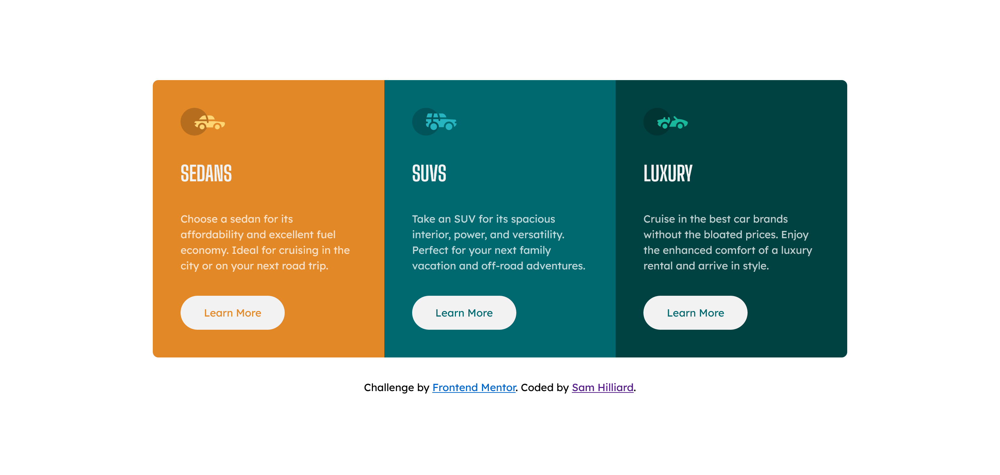

# Frontend Mentor - 3-column preview card component solution

This is a solution to the [3-column preview card component challenge on Frontend Mentor](https://www.frontendmentor.io/challenges/3column-preview-card-component-pH92eAR2-). Frontend Mentor challenges help you improve your coding skills by building realistic projects. 

## Table of contents

- [Frontend Mentor - 3-column preview card component solution](#frontend-mentor---3-column-preview-card-component-solution)
  - [Table of contents](#table-of-contents)
  - [Overview](#overview)
    - [The challenge](#the-challenge)
    - [Screenshot](#screenshot)
    - [Links](#links)
  - [My process](#my-process)
    - [Built with](#built-with)
    - [What I learned](#what-i-learned)
    - [Continued development](#continued-development)
    - [Useful resources](#useful-resources)
  - [Author](#author)
  - [Acknowledgments](#acknowledgments)

## Overview

For this challenge I used CSS-grid and flexbox to make a simple, responsive three column layout.

### The challenge

Users should be able to:

- View the optimal layout depending on their device's screen size
- See hover states for interactive elements

### Screenshot

### Links

- Solution URL: [repo](https://github.com/sam-hilliard/three-col-preview-card-component)
- Live Site URL: [site](https://sam-hilliard.github.io/three-col-preview-card-component/)

## My process

### Built with

- CSS custom properties
- Flexbox
- CSS Grid
- Mobile-first workflow

### What I learned

This was great practice for using CSS grid and flexbox. I often struggle with deciding when to use
these two layout tools. Having more practice boosted my confidence.

### Continued development

I hope to continue practicing with these two layout tools so I can make responsive sites more efficiently
and easier.

### Useful resources

- [Kevin Powell's YouTube Channel]((https://www.youtube.com/kevinpowell) - I love this channel for all things CSS.

## Author

- Website - [Sam Hilliard](https://sam-hilliard.github.io/)
- Frontend Mentor - [@samhill15](https://www.frontendmentor.io/profile/samhill15)

## Acknowledgments

Shoutout to Kevin Powell for providing free content that pushes me to become a better frontend developer.
